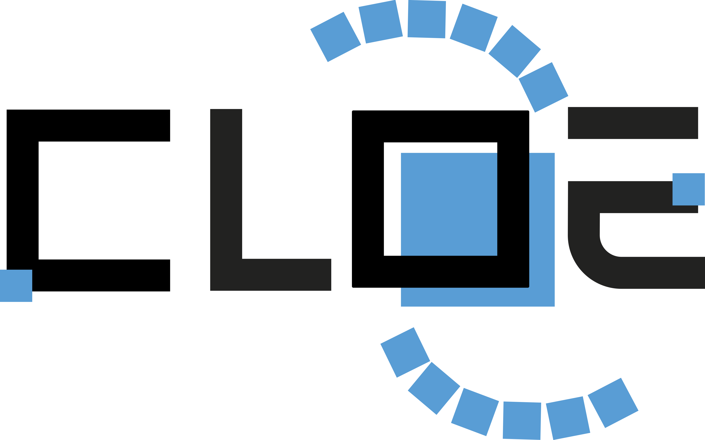

# CLOE: Cosmology Likelihood for Observables in *Euclid*



[](https://github.com/cloe-euclid/cloe/actions/workflows/ci.yml)
[](https://codecov.io/gh/cloe-euclid/cloe)
[](https://www.gnu.org/licenses/lgpl-3.0.en.html)
[](https://cloe-euclid.readthedocs.io/en/latest/)

This repository allows the user to obtain model predictions and cosmological parameter constraints for synthetic and real *Euclid* data. 
It is developed by members of the Euclid Consortium (EC).

In the latest version of CLOE, the cosmological observables are defined by the following set:

- Cosmic shear tomography
- Photometric galaxy clustering tomography
- Photometric galaxy-galaxy lensing tomography
- Spectroscopic / Redshift-space galaxy clustering
- Cross-correlations with the cosmic microwave background
- Galaxy cluster probes

CLOE allows the user to consider these probes either separately or in a self-consistent combined analysis.
It is also possible to analyze the *Euclid* data alongside other external datasets within the
[Cobaya](https://cobaya.readthedocs.io/en/latest/) and [CosmoSIS](https://cosmosis.readthedocs.io/en/latest/) platforms.
CLOE moreover allows the user to obtain the linear matter power spectrum and background expansion from either of the [CAMB](https://camb.readthedocs.io/en/latest/) and [CLASS](https://lesgourg.github.io/class_public/class.html) Boltzmann codes.

Further documentation is found in the [CLOE Read the Docs](https://cloe-euclid.readthedocs.io/).
The full development history is available to EC members [here](https://gitlab.euclid-sgs.uk/pf-ist-likelihood/likelihood-implementation).

## Installation

Clone the CLOE repository through the following command:

```shell
git clone https://github.com/cloe-euclid/CLOE.git
```

Next, create a Conda environment using `environment.yml` that we provide, which includes all the required dependencies with fixed versions that have been tested with CLOE:

```shell
conda env create -f environment.yml
conda activate cloe
pip install .
```

If our environment does not work on your cluster, we provide additional installation instructions in the [CLOE Read the Docs](https://cloe-euclid.readthedocs.io/).
Lastly, in order to use CLOE with CosmoSIS, one needs to add the line

```shell
cloe_parameters = "cloe_parameters"
```

in `cosmosis/datablock/cosmosis_py/section_names.py` where CosmoSIS is installed. No additional steps are required for Cobaya.

## Running CLOE

### With YAML file

CLOE can be run through the following command that uses the configuration YAML file:

```shell
python run_cloe.py configs/config_default.yaml
```

A shorthand version of this is `./run_cloe.py`. 

### With Python script

CLOE can alternatively be run through a Python script, examples of which are provided in the `mcmc_scripts` directory. 
In a combined analysis of the 3×2pt observables and redshift-space galaxy clustering in ΛCDM, the user would thereby execute:

```shell
python mcmc_scripts/runmcmc_3x2pt+GCsp_LCDM.py
```

In either of these cases, the user can perform the run on a computing cluster through the example script provided in `example_mcmc_script_for_cluster.sh`. 
In both cases, the output is written to a folder called `chains` that is generated at runtime. 
These chains can then be used to obtain the marginalized parameter constraints and contours using public tools such as [GetDist](http://getdist.readthedocs.io/).

## Graphical User Interface

We have created a Graphical User Interface (GUI) to assist users in running CLOE. This GUI targets beginner users in particular, by allowing them to rapidly produce CLOE-compatible configurations. To this end, the GUI is not designed to perform a Monte Carlo run, but rather allows the user to generate the configuration files needed for such a run. The GUI is also not meant to replace the configuration files in the `configs` directory, but rather provides an interactive way to guide users in the creation of these files.

The GUI is activated by executing `gui/script_gui.py`.

The primary limitation of the GUI is that it provides less fine-grained control over CLOE options compared to the direct usage of the configuration files. As a result, more advanced users will likely prefer to either directly modify the example configuration files that we have provided or create entirely new files themselves. Users also have the possibility to modify the GUI-generated configuration files at the command line.

## Using CLOE with External Datasets

CLOE can be used together with external datasets as part of the Cobaya and CosmoSIS platforms. Note however that some of these external datasets require a separate installation. 
In particular, the CLOE conda environment does not include the Planck likelihood and the user will therefore need to separately install it to consider a combined analysis of Euclid and Planck.

Once the Planck likelihood is installed, the `likelihood` block for CLOE with Cobaya and the `pipeline` block for CLOE with CosmoSIS will need to be updated in the standard way for the use of this dataset on the Cobaya/CosmoSIS platforms.

As a concrete example, in the case of Cobaya, the following lines can be included in `config_default.yaml` (in the same way as *Euclid*):

	likelihood:
  		planck_2018_lowl.TT_clik:
    		clik_file: /your/path/to/plc_3.0/low_l/commander/commander_dx12_v3_2_29.clik
  		planck_2018_lowl.EE_clik:
    		clik_file: /your/path/to/plc_3.0/low_l/simall/simall_100x143_offlike5_EE_Aplanck_B.clik
  		planck_2018_highl_plik.TTTEEE:
    		clik_file: /your/path/to/plc_3.0/hi_l/plik/plik_rd12_HM_v22b_TTTEEE.clik

If the *Planck* likelihood is installed via `cobaya-install` (which is a feature of Cobaya and not CosmoSIS), then the `clik_file` lines above need to be removed.

Instead of directly editing `config_default.py`, it is also possible to add the corresponding call in the `likelihood` block within the `info` dictionary of the example run scripts provided in the `mcmc_scripts` directory of CLOE. 
These example scripts accomplish exactly the same commands as the `run_cloe.py` instructions. The CLOE team has constructed the scripts from an internal notebook that is based on the contents of `config_default.yaml`.

## Structure of the repository
*  **cloe**: folder containing the CLOE source code and unit tests in Python (see the [API documentation](https://cloe-euclid.readthedocs.io/en/latest/api/index.html) for details)
*  **cosmosis**: folder containing the CLOE source code in Python and configuration files in INI for its CosmoSIS interface
*  **configs**: folder containing configuration files in YAML, which allow the user to choose analysis settings such as the cosmological probes, summary statistics, scale cuts, parameter space, and systematic uncertainties. 
*  **data**: folder containing the data products (be it real or synthetic)
*  **docs**: folder containing automatically generated documentation
*  **gui**: folder containing the graphical user interface
*  **mcmc scripts**: folder containing example Python scripts to run MCMC chains for different combinations of probes, cosmological parameters, and treatments of systematic uncertainties
*  **notebooks**: folder containing demonstration and validation Jupyter Notebooks
*  **scripts**: folder containing example Python scripts to simulate data and example YAML files
*  ```environment.yml```: file specifying the CLOE conda environment
*  ```readthedocs.yml```: Read the Docs configuration file
*  ```example_mcmc_script_for_cluster.sh```: example shell script for submitting jobs on a computing cluster
*  ```run_cloe.py```: top level script for running the CLOE user interface
*  ```setup.py```: top level script for installing or testing CLOE
*  ```Dockerfile```: CLOE Docker image
*  ```CONTRIBUTING.md```: CLOE contribution guidelines
*  ```LICENSE```: file containing the LGPL license of CLOE

## Unit and Verification Tests

To run the unit tests locally:

```shell
python -m pytest
```

To run the verification tests locally:

```shell
python -m pytest cloe/tests/verification
```

## Demonstration and Validation Notebooks

Learn how to use CLOE with our Jupyter Notebooks. These can be launched in the following way, here in the case of the demo notebook:

```shell
jupyter-notebook notebooks/DEMO.ipyng
```

This notebook illustrates how to compute the theory predictions and likelihood for the primary probes given synthetic Euclid data.
More broadly, CLOE contains a variety of Jupyter Notebooks in the `notebooks` directory that demonstrate its use and perform distinct validations. 

## License and Credits

CLOE is released by the Euclid Consortium. It is open source and available under terms consistent with our license based on [LGPL](https://www.gnu.org/licenses/lgpl-3.0).
If you use CLOE, please cite this repository and the CLOE papers (found [here](https://cloe-euclid.readthedocs.io/en/latest/cite_us.html)). 
In addition, please cite the associated papers and adhere to the corresponding licenses of codes that CLOE utilizes (such as `CAMB`, `CLASS`, `HMCODE`, `BACCO`, and `FAST-PT`).
